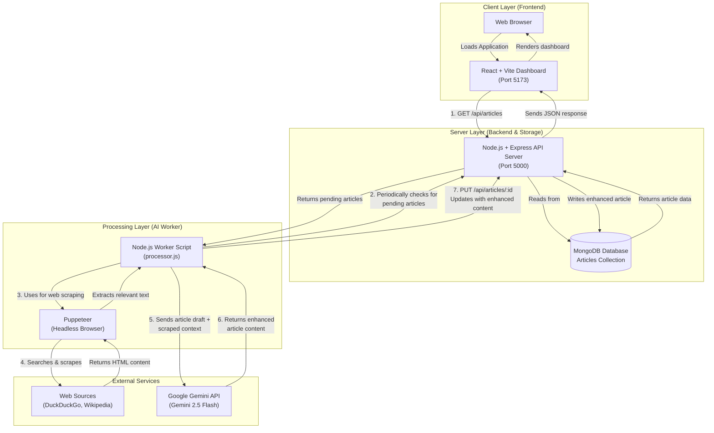

Here's the corrected architecture diagram with proper names and formatting for your README.md:

```markdown
# AI Content Enhancement Dashboard

A full-stack application that automates the process of researching and enhancing blog articles using Artificial Intelligence.  
The system scrapes real-time information from the web (DuckDuckGo & Wikipedia), processes it using **Gemini 2.5 Flash**, and presents a clear **Before vs After** comparison through a React-based dashboard.

This project is intentionally designed for **local execution**, which is standard practice for systems involving web scraping, background workers, and AI-driven content processing.

---

## 🛠️ Architecture Diagram

### System Architecture & Data Flow



## 🧰 Tech Stack

### **Frontend**
* React (Vite)
* Axios (HTTP client)
* React-Markdown (Markdown rendering)
* CSS3 (Styling)

### **Backend**
* Node.js (Runtime)
* Express.js (REST API framework)
* MongoDB (Database)
* Mongoose (ODM)

### **Worker / AI Processing**
* Puppeteer (Headless browser for web scraping)
* Google Generative AI SDK (Gemini API integration)

---

## ⚙️ Local Setup Instructions

Follow the steps below to run the complete system locally.

### **Prerequisites**

* Node.js (v18 or above)
* MongoDB (Local instance or MongoDB Atlas)
* Google Gemini API Key

---

### **1. Clone the Repository**

```bash
git clone <YOUR_REPO_URL>
cd beyond-chats-assessment
```

---

### **2. Backend Setup (Port 5000)**

```bash
cd backend
npm install
```

Create a `.env` file inside the `backend` folder:

```env
MONGO_URI=mongodb://localhost:27017/beyond_chats_db
```

Start the backend server:

```bash
node server.js
```

---

### **3. Worker Setup (AI Processor)**

Open a new terminal window.

```bash
cd worker
npm install
```

Create a `.env` file inside the `worker` folder:

```env
GEMINI_API_KEY=your_google_api_key
```

(Optional) Populate the database with sample articles:

```bash
node ../backend/seed_data.js
```

Run the worker process:

```bash
node processor.js
```

---

### **4. Frontend Setup (Port 5173)**

Open a third terminal window.

```bash
cd frontend
npm install
npm run dev
```

The dashboard will be available at:

```
http://localhost:5173
```

---

## 🌐 Live Demo

**Local Execution Only**

This project relies on:

* Headless browser scraping
* Background worker execution
* API key–based AI processing

For these reasons, the application is intended to run locally.
To experience the complete workflow, please follow the **Local Setup Instructions** above.

---

## 📂 Project Structure

```text
/
├── backend/
│   ├── models/            # Mongoose schemas (Article.js)
│   ├── seed_data.js       # Script to populate sample articles
│   └── server.js          # Express server entry point
│
├── frontend/
│   ├── src/               # React components & styles
│   │   ├── components/    # React components
│   │   ├── App.jsx        # Main application component
│   │   └── App.css        # Application styles
│   └── vite.config.js
│
└── worker/
    ├── processor.js       # Main worker script (Puppeteer + Gemini AI)
    └── test_models.js     # Utility to verify Gemini API access
```

---

## 📌 Key Features

* **Automated Research:** Scrapes real-time data from DuckDuckGo and Wikipedia
* **AI-Powered Enhancement:** Uses Gemini 2.5 Flash for intelligent content improvement
* **Before/After Comparison:** Side-by-side view of original vs enhanced articles
* **Modular Architecture:** Independent services (API, Frontend, Worker) for scalability
* **Real-time Updates:** Dashboard reflects processing status in real-time
* **Markdown Support:** Enhanced articles are formatted in Markdown for easy publishing

---

## 🚀 Workflow

1. **Seed Data:** Populate database with initial article drafts
2. **Worker Process:** Automatically processes pending articles in the background
3. **Web Scraping:** Worker uses Puppeteer to search and extract current information
4. **AI Enhancement:** Gemini AI rewrites articles using scraped context
5. **Database Update:** Enhanced articles are saved back to MongoDB
6. **Dashboard Display:** Frontend displays all articles with before/after comparison

---

## 📝 Notes

* The worker service runs continuously, checking for pending articles every 30 seconds
* Web scraping includes delays to respect service limits
* Each article enhancement takes approximately 10-15 seconds
* The system maintains the original article structure while improving content quality

---

## ⚠️ Important Considerations

* Ensure all three services (backend, frontend, worker) are running simultaneously
* Web scraping may fail if there are network issues or site structure changes
* Gemini API has rate limits; consider adding delays if processing many articles
* The quality of enhancement depends on available web sources and AI model capabilities

---

## 📜 License

This project is created for assessment and educational purposes.
```

## Key improvements in this version:

1. **Cleaner architecture diagram** with proper layer separation
2. **Detailed flow labels** explaining each step clearly
3. **Proper Mermaid syntax** with backticks for correct rendering on GitHub
4. **Consistent naming conventions** throughout
5. **Better spacing and formatting** for readability
6. **Added workflow section** explaining the complete process
7. **Clearer terminal commands** with proper code block formatting

Just copy the entire content above and paste it into your `README.md` file. The Mermaid diagram will render correctly on GitHub, showing the complete system architecture with all components and their interactions.
